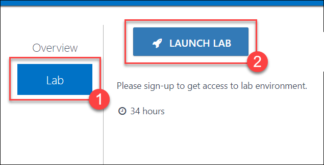

# Introduction

Azure Resource Manager (ARM) is a one day workshop lead by Microsoft or Microsoft partners.These one day focus on hands-on activities that  deploy to infrastructure such as virtual machine, storage, and networking.This lab will also teach the attendees how to deploy virtual machines that are automatically configured by the Azure Automation Desired State Configuration (DSC) service.
* How to author and deploy an ARM template 
* How to perform configuration management with Azure Automation DSC
 
# Sign-up for Workshop Environment

To make it easier for you to work on the labs, you are provided with pre-provisioned Azure environment. You will receive sign-up link for the lab environment from your instructor. 

* Register for the lab environment by providing your information and clicking on **Submit** button.

* On the next page, click the **Launch Lab** button.
  
  
* Wait for the lab environment to be provisioned. Sometimes this can take upto **10 minutes**. Once environment provisioning is complete, you will receive details in email as well as in the browser.
 
 
 > Note: Lab environment is enabled only for specific duration or workshop end time - whichever is earlier. At the end of the allowed time, environment will be self-destructed.
 
# Verify the pre-provisioned Environment

## Verify Azure Access

Open a browser instance in private or incognito mode and login to [Microsoft Azure Portal](https://portal.azure.com) using the credentials provided.

> Note: You might have an existing Azure Credential. For the pre-provisioned environment, new Microsoft Azure environment is provisioned and new AAD user is created for you. To prevent conflict with your existing accounts, it is advised to use In Private mode of IE / IE Edge or Incognito mode of Chrome browser.

## Verify Virtual Machine

You are provided a Visual Studio Community 2017 on Windows Server 2016 (x64)Microsoft with additional softwares configured.FQDN of the virtual machine and administrator credentials are provided in the lab details page. You can remote into the virutal machine using the provided credentials and validate the following:

> Note: VM is provisioned in the resource group, in which you have access. Once you login to Microsoft Azure Portal, you can navigate to this VM to find more details.

* **Helper codes folder** ans **Hands-on Lab Guide** is downloaded on the virtual machine. You should see the icon on **Desktop** or else, you can find / search it from the **Start Menu** 

# Known Issues

Webpage might takes 15-20 minutes to come up.Refresh the browser after 20-25 mins to view the web page.

# Notes to Instructors / Proctors

* User can use the same size of vm which is provided in document.

# Help and Support

If you require any help during the workshop, please reach out to the instructor / proctors. Instructors / proctors might escalate the issue to remote support team, at that time, please pass on your AAD User ID (aad_user_xyz), so that it is easier to look up your environment.

  
